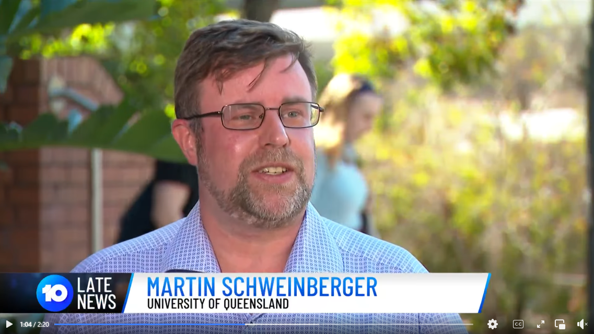
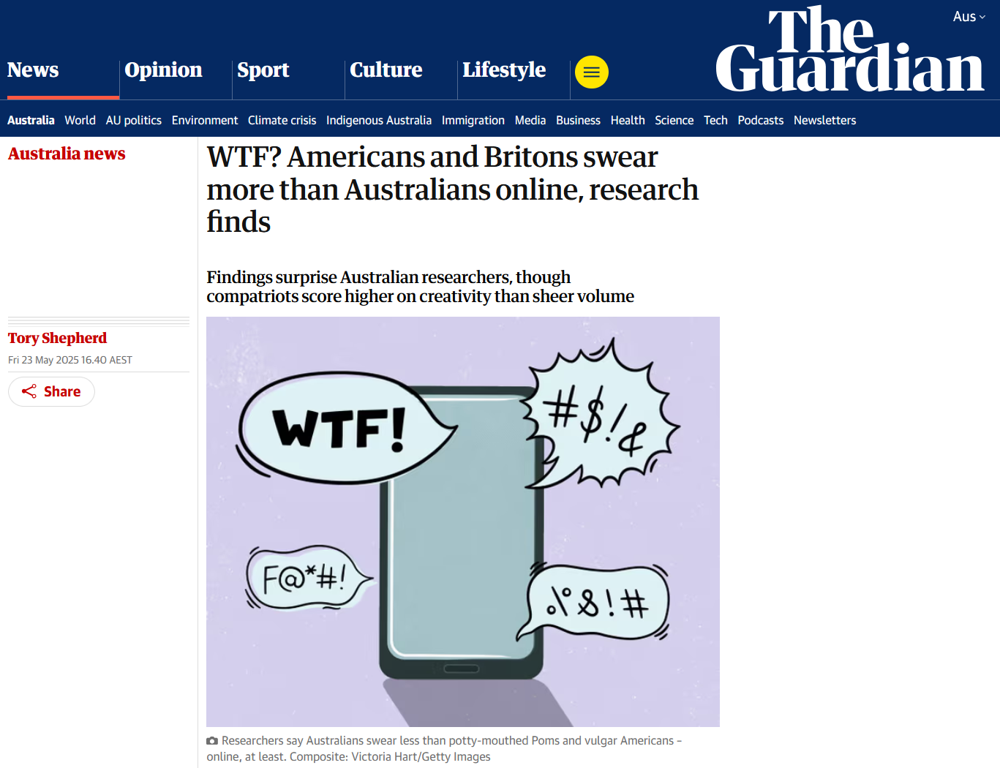

```{=html}
<div class="pg-header">
  <div class="pg-header-inner">
    <p class="pg-eyebrow">Public reach</p>
    <h1 class="pg-title">Media Coverage</h1>
    <p class="pg-subtitle">96+ media reports &nbsp;·&nbsp; 205M+ potential reach &nbsp;·&nbsp; TV, national radio, international press &nbsp;·&nbsp; AU$1.9M advertising equivalent</p>
    <div class="pg-header-badges">
      <span class="pg-hbadge">Channel 10 News</span>
      <span class="pg-hbadge">ABC Radio</span>
      <span class="pg-hbadge">The Guardian</span>
      <span class="pg-hbadge">Der Spiegel</span>
      <span class="pg-hbadge">CNN</span>
    </div>
  </div>
</div>
```


## TV Appearances

[{.float-end width=450px fig-alt="Channel 10 News segment screenshot"}](https://www.facebook.com/10NewsFirst/videos/1908501349952962/)

**Channel 10**

- [Facebook Video](https://www.facebook.com/10NewsFirst/videos/1908501349952962/)
- [TikTok Video](https://www.tiktok.com/@10newsfirst/video/7507491979412966663)
- [LeadStory Feature](https://www.leadstory.com/v/study-finds-australia-ranks-third-for-swearing-202552330)

**The Project**

- [Instagram Reel mentioning my research](https://www.instagram.com/theprojecttv/reel/DJ_YT4FTTqT/)

---

## Radio Appearances

- **ABC Melbourne – Victorian Evenings with David Astle** (3 June 2025, 0:28:28–0:42:38)  
  [Listen here](https://www.abc.net.au/listen/programs/melbourne-evenings/evenings/105360986)

- **ABC Hobart – Afternoons with Joel Rheinberger** (30 May 2025, 4:15–18:50)  
  [Listen here](https://www.abc.net.au/listen/programs/hobart-your-afternoon/afternoons/105336798)

- **ABC Drive North Queensland with Adam Stephen** (23 May 2025, 1:04:45–1:13:50)  
  [Listen here](https://www.abc.net.au/listen/programs/north-qld-drive/drive/105312338)

- **ABC Drive Melbourne with Ali Moore** (23 May 2025, 0:18:10–0:25:40)  
  [Listen here](https://www.abc.net.au/listen/programs/melbourne-drive/drive/105312406)

- **ABC Drive Brisbane with Ellen Fanning** (22 May 2025, 0:17:50–0:33:00)  
  [Listen here](https://abc.net.au/listen/programs/brisbane-drive/drive/105307926)

**Radio Coverage of the Research**

- [Floods and Foul Language Down Under (Primedia)](https://www.primediaplus.com/2025/05/23/floods-and-foul-language-down-under)
- [SBS Audio – Why Do We Curse and Swear?](https://www.sbs.com.au/audio/podcast-episode/why-do-we-curse-and-swear/oifwcbw5k)

---

## Media Releases

**Australian Research Data Commons (ARDC)**

- [Tweets Illuminate the Impact of COVID-19](https://ardc.edu.au/case-study/tweets-illuminate-the-impact-of-covid-19-on-society/)
- [Which Country Swears the Most?](https://ardc.edu.au/article/oh-sht-which-country-swears-the-most-online/)
- [ARDC LinkedIn Post](https://www.linkedin.com/posts/australian-research-data-commons_ardc-ladal-language-activity-7331457482491367424-8yDi/)

**UQ**

-UQ Contact Magazine: [Why people who swear may be smarter](TBD)

- UQ News: [Australians Third Most Prolific Swearers](https://www.uq.edu.au/news/article/2025/05/global-study-finds-australians-are-third-most-prolific-swearers)

---

## Newspapers and Magazines (vulgarity and swearing)

[{.float-end width=450px fig-alt="Guardian article screenshot"}](https://www.theguardian.com/australia-news/2025/may/23/americans-british-swear-more-online-than-australians)

- [The Guardian](https://www.theguardian.com/australia-news/2025/may/23/americans-british-swear-more-online-than-australians)
- [The Conversation](https://theconversation.com/201-ways-to-say-fuck-what-1-7-billion-words-of-online-text-shows-about-how-the-world-swears-257815)
- [CNN](https://edition.cnn.com/2025/06/15/health/swear-words-conversation-partner)
- [Epoch Times](https://www.theepochtimes.com/world/study-finds-aussies-swear-less-online-than-americans-and-brits-5862282)
- [Der Spiegel](https://www.spiegel.de/kultur/wtf-dieser-nation-rutscht-am-haeufigsten-das-f-wort-raus-a-64907cac-4398-4628-b616-a584df7b6ced)
- [Deutsche Welle](https://www.dw.com/en/americans-more-vulgar-online-than-brits-aussies-study/a-72986152)
- [The Canberra Times](https://www.canberratimes.com.au/story/8973934/surprise-as-australians-found-swearing-less-than-others/)
- Yahoo: [Article 1](https://au.news.yahoo.com/surprise-australians-found-swearing-less-224743242.html) | [Article 2](https://www.yahoo.com/lifestyle/us-ranks-first-swearing-143908925.html)
- [Popular Science](https://www.popsci.com/science/americans-swearing-study/) | [Facebook Post](https://www.facebook.com/PopSci/photos/a-new-study-found-we-beat-out-a-notoriously-foul-mouthed-nation-httpstribaloevtc/1066167412051764)
- [1News](https://www.1news.co.nz/2025/05/28/how-do-kiwis-compare-with-other-countries-for-swearing-online/)
- Daily Mail: [Article 1](https://www.dailymail.co.uk/sciencetech/article-14743627/UK-comes-second-global-swearing.html) | [Article 2](https://www.dailymail.co.uk/sciencetech/article-15366495/Americans-f-word-frequently-Brits-Australians-study.html)
- [LeadStory](https://www.leadstory.com/v/study-finds-australia-ranks-third-for-swearing-202552330)
- The New Daily: [Article 1](https://www.thenewdaily.com.au/news/people/2025/05/23/australia-online-swearing) | [Article 2](https://www.thenewdaily.com.au/news/people/2025/05/23/australia-online-swearing)
- [MSN](https://www.msn.com/en-au/news/australia/surprise-as-australians-found-swearing-less-than-others/ar-AA1Fj23L)
- [SBS News](https://www.sbs.com.au/news/article/australians-swear-less-than-some-other-nations-research-suggests/dw436hub1)
- [Phys.org](https://phys.org/news/2025-05-global-australians-prolific-swearers.html)
- [Mirage News](https://www.miragenews.com/australians-rank-third-in-global-swearing-study-1465442/)
- [Border Mail](https://www.bordermail.com.au/story/8973934/surprise-as-australians-found-swearing-less-than-others/)
- [The Stansbury Show](https://wmms.iheart.com/featured/the-stansbury-show/content/2025-05-27-were-number-one-us-tops-in-the-world-when-it-comes-to-swearing/)
- [Medium](https://medium.com/wise-well/the-art-and-science-of-swearing-5fadb0b6c979)

---

## Newspapers and Magazines (other topics)

- [NZ Stuff](https://www.stuff.co.nz/national/113796639/why-do-new-zealanders-say-eh-so-much) — Article on my study of *eh* in New Zealand English

---

## Social Media Coverage

- [Instagram Reel](https://www.instagram.com/reel/DKApuXxtp1V/)
- [Twitter/X Post](https://x.com/10NewsFirst/status/1925887728505282887)
