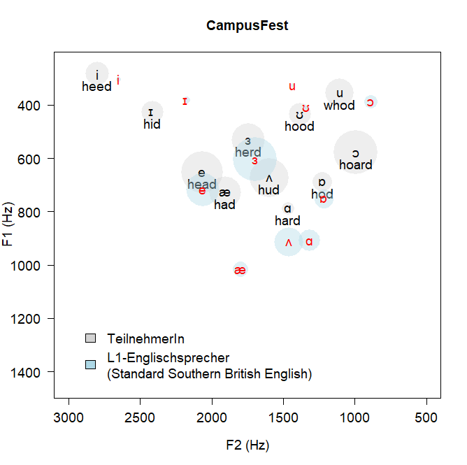

```{=html}
<div class="pg-header">
  <div class="pg-header-inner">
    <p class="pg-eyebrow">What I do</p>
    <h1 class="pg-title">Research &amp; Projects</h1>
    <p class="pg-subtitle">Computational corpus linguistics &nbsp;·&nbsp; Digital discourse &nbsp;·&nbsp; Language data science</p>
    <div class="pg-header-badges">
      <span class="pg-hbadge">LADAL Director</span>
      <span class="pg-hbadge">LDaCA CI</span>
      <span class="pg-hbadge">ARDC HASS Digital Champion 2019</span>
    </div>
  </div>
</div>
```

```{=html}
<div class="tag-cloud">
  <span class="tag tag-navy">Corpus linguistics</span>
  <span class="tag tag-navy">Digital discourse</span>
  <span class="tag tag-navy">Language variation &amp; change</span>
  <span class="tag tag-navy">Social media analysis</span>
  <span class="tag">R / RStudio</span>
  <span class="tag">NLP &amp; machine learning</span>
  <span class="tag">Statistical modeling</span>
  <span class="tag">Acoustic phonetics</span>
  <span class="tag tag-gold">Reproducibility &amp; open science</span>
  <span class="tag tag-gold">FAIR data principles</span>
  <span class="tag tag-gold">Research infrastructure</span>
</div>
```

## Research Profile

My research sits at the intersection of corpus linguistics, computational humanities, and applied linguistics. I use large language corpora and computational methods — primarily R, but also Python, NLP pipelines, and machine-learning classifiers — to investigate how language varies across social groups, national varieties, and digital contexts, and how it changes over time. A unifying concern across all my work is methodological rigour: how we collect, process, analyse, and report on language data matters as much as what we find, and I have made reproducibility and transparency in empirical language research a central part of my scholarly identity.

My empirical work spans several interconnected lines. I have a long-standing interest in **language variation and change** in varieties of English — particularly how semantically bleached elements such as discourse particles (*like*, *eh*) and degree adverbs (intensifiers such as *very*, *really*, *absolutely*) pattern socially and change over time. This variationist strand connects to work on **learner language and applied linguistics**, where I examine how L2 learners acquire variable linguistic features alongside native-speaker norms. A second major strand focuses on **digital discourse and vulgarity** — using computational corpus methods to analyse swearing, impoliteness, and sociolinguistic variation in born-digital data, work that has attracted substantial international media attention. A third strand addresses **computational acoustic phonetics**, using automated formant extraction and machine-learning classifiers to analyse the vowel systems of learners of English from different L1 backgrounds.

Cutting across all of these empirical strands is my commitment to **open, reproducible, and transparent research**. I have argued — in a plenary at ICAME 42, in a co-edited special issue of the *International Journal of Corpus Linguistics*, and in a chapter for Cambridge University Press — that corpus linguistics faces the same reproducibility challenges as other empirical disciplines, and that the field needs shared standards for data management, analysis reporting, and research transparency. This is not merely a methodological position: it directly motivates my infrastructure work through [LADAL](https://ladal.edu.au) and [LDaCA](https://www.ldaca.edu.au), which build the open-access tools, tutorials, and data commons that make reproducible language research practically achievable at scale.

[LADAL](https://ladal.edu.au) — the Language Technology and Data Analysis Laboratory, which I established at UQ in 2019 — is the most visible expression of this commitment. LADAL provides free, open-source tutorials, interactive notebooks, and case studies in corpus linguistics, text analytics, and quantitative methods for the humanities. Its resources have been accessed by over 500,000 researchers worldwide and viewed more than 1.1 million times, making it one of the most widely used open-access resources in computational humanities globally.

---

## Research Focus Areas

(see the[Awards page for funded projects and grants](awards.qmd))

### 1. Language Data Commons of Australia (LDaCA) & LADAL

Australia holds large and diverse collections of language data, many stored in short-lived repositories or in siloed institutional archives. The aim of LDaCA is to consolidate these into a nationally integrated research data infrastructure of high strategic importance — establishing governance, access policy, shared technical infrastructure, a discovery portal, and community engagement to secure and make accessible Australia's linguistic heritage, including Indigenous language materials.

My contribution to LDaCA centres on two things: building the open-access training and support ecosystem through **LADAL**, and developing the text analytics capacity of the broader HASS research community. LADAL provides the human side of the infrastructure — the tutorials, workshops, and interactive learning resources that enable researchers without specialist computational training to work effectively with language data. Since its establishment in 2019, LADAL has grown into a globally recognised resource, with over 60 tutorials covering corpus linguistics, text analytics, statistical modelling, data visualisation, and reproducible research practices in R.

The **Australian Text Analytics Platform (ATAP)**, which I co-led as Chair of the User Advisory Group from 2021–2023, was developed under the LDaCA umbrella before being integrated in 2024. ATAP filled the gap between generic text analytics tools and highly specialised custom code, developing an integrated, notebook-based platform for processing and analysing language data at scale.

- *Scheme:* HASS Research Data Commons (RDC) and Indigenous Research Capability Program (ARDC)
- *Role:* CI & Steering Committee (Project lead: Michael Haugh)
- *Funding period:* 2021–2029 (Phase I: 2021–2023; Phase II: 2024–2029)
- *ATAP scheme:* ARDC Platforms Program, 2021–2023

**Selected publications:** [LADAL chapter (Springer, 2021)](https://link.springer.com/chapter/10.1007/978-3-030-46309-0_9) · [Replication crisis chapter (CUP, 2025)](https://www.cambridge.org/core/books/abs/dataintensive-investigations-of-english/implications-of-the-replication-crisis/7EBD8DA77FA7E49FC9468A525F64246B) · [Reproducibility & corpus linguistics, *IJCL* 2025](https://doi.org/10.1075/ijcl.25081.sch) · [COVID-19 Twittersphere, *Big Data & Society* 2021](https://journals.sagepub.com/doi/full/10.1177/20539517211021437) · *in prep.:* Introducing LADAL (*Language Resources and Evaluation*)

**Selected talks:** [ICAME 42 Plenary](resources/ICAME42_Plenary_Schweinberger-3.pdf) · [ICAME 42 LADAL talk](resources/ICAME42_LADAL_Schweinberger.pdf) · [ARDC eResearch Summit 2019](resources/HaughSchweinberger_eResearchSummit_20190730.pptx) · [ARDC Webinar 2019](resources/HaughSchweinberger_ARDC_Webinar_20191029.ppt) · [LDaCA & LADAL, LiRI Zürich 2024](presentations.qmd#invited-talks) · [LADAL UEF 2020](resources/LADAL_experiences_20201125_compressed.pdf) · [Computational Thinking in the Humanities 2022](resources/Schweinberger_Lightning_20220829.pdf)

---

### 2. Reproducibility and Transparency in Empirical Language Research

Alongside the infrastructure work, I pursue a dedicated research and advocacy strand focused on reproducibility, replicability, and transparency in corpus-based and computational language research. This work is motivated by the observation that corpus linguistics — like psychology, medicine, and other empirical disciplines — is vulnerable to researcher degrees of freedom, selective reporting, and irreproducible workflows, yet has been slower than other fields to engage systematically with these challenges.

My contributions to this area include: a **plenary at ICAME 42** on corpus linguistics and the replication crisis; co-editing (with Michael Haugh) a **special issue of the *International Journal of Corpus Linguistics*** on reproducibility, replication, and robustness in corpus linguistics (2025); publishing two papers in that special issue — one on reproducibility in interpretive corpus pragmatics and one providing a conceptual framework for the field; a **chapter in a Cambridge University Press volume** (*Data-Intensive Investigations of English*, 2025) on the implications of the replication crisis for corpus linguistics; and a forthcoming chapter in the *International Encyclopedia of Language and Linguistics* (3rd edition) on reproducibility in corpus linguistics. I am also under contract with **Cambridge University Press** for *Data-Intensive Pragmatics* (Cambridge Elements in Pragmatics series), which develops a framework for doing corpus pragmatics at scale in a transparent and reproducible way.

This research line connects directly to LADAL, where all tutorials are written as fully reproducible R Markdown / Quarto documents with openly available data and code, and to the Sydney Corpus Lab reproducibility talk and ISLE 6 workshop I co-organised with Joseph Flanagan.

**Selected publications:** [Reproducibility & corpus pragmatics, *IJCL* 2025](https://doi.org/10.1075/ijcl.23033.sch) · [Reproducibility framework, *IJCL* 2025](https://doi.org/10.1075/ijcl.25081.sch) · [Replication crisis, CUP 2025](https://www.cambridge.org/core/books/abs/dataintensive-investigations-of-english/implications-of-the-replication-crisis/7EBD8DA77FA7E49FC9468A525F64246B) · *in print:* Reproducibility in corpus linguistics (*International Encyclopedia of Language and Linguistics*) · *in prep.:* Data-Intensive Pragmatics (Cambridge UP)

**Selected talks:** [ICAME 42 Plenary](resources/ICAME42_Plenary_Schweinberger-3.pdf) · [Sydney Corpus Lab 2022](resources/SCL_Reproducibility_Schweinberger_min-1.pdf) · [ReproL2 UHH 2023](resources/ReproL2_UHH_Schweinberger.pdf) · [ISLE 6 Reproducibility Workshop 2021](presentations.qmd#conference--workshop-organization) · [ICAME 42 Reproducibility Workshop 2021](presentations.qmd#conference--workshop-organization) · [ISLE 6 BestPractices Poster](resources/ISLE2021_BestPractices_Schweinberger_20210423.pdf)

---

### 3. Vulgarity and Bad Language in Online and Public Discourse

This is one of my most active current research lines, combining corpus-linguistic, sociolinguistic, and computational methods to investigate vulgarity, profanity, and impoliteness in digital and public discourse across varieties of English. Using large-scale Twitter/X corpora and spoken data, I examine the frequency, distribution, social patterning, and discourse functions of vulgar language across Australia, the UK, and the USA — and increasingly in spoken interaction across World Englishes more broadly.

The project spans multiple funded sub-projects: a UQ Digital Cultures and Societies Hub project on swearing on Twitter (2022–2023, AU$15,075), a School of Languages and Cultures Research Support project with Svenja Kranich at Universität Bonn (2024, AU$3,000), and contributions to an international collaborative network. I co-edited a special issue of *Lingua* ([Bad Language and Vulgarity Online and in Public Discourse](https://www.sciencedirect.com/special-issue/10JMTRGXHQT), 2025/26) with Paula Rautionaho and Kate Burridge, and have an article under contract as the editorial introduction to that volume. This research has attracted widespread media attention, including coverage on Channel 10 News, five ABC Radio programmes, *The Guardian*, *Der Spiegel*, *CNN*, and over 96 other media reports reaching an estimated audience of 205 million with an advertising equivalent of AU$1.9 million.

- *Funding:* UQ Digital Cultures and Societies Hub (AU$15,075, 2022–2023); SLC Research Support Scheme (AU$3,000, 2024)
- *Collaborators:* Kate Burridge (Monash), Michael Haugh (UQ), Mikko Laitinen & Paula Rautionaho (Univ. of Eastern Finland), Sam Hames (UQ), Marissa Takahashi (QUT), Svenja Kranich (Univ. Bonn), Amir Sheikhan (UniSA)

**Selected publications:** [Vulgarity in Online Discourse, *Lingua* 2025](https://www.sciencedirect.com/science/article/pii/S0024384125000713) · [Vulgarity intro, *Lingua* 2026](https://doi.org/10.1016/j.lingua.2026.104133) · *submitted:* F%$# Twitter (*Corpora*) · *submitted:* Swearing online (*Digital Scholarship in the Humanities*) · *submitted:* Pop Goes Profanity · [*The Conversation*, 2025](https://theconversation.com/201-ways-to-say-fuck-what-1-7-billion-words-of-online-text-shows-about-how-the-world-swears-257815)

**Selected talks:** [FoEiA 2025](https://github.com/MartinSchweinberger/slides/raw/refs/heads/main/VulgarityAroundTheWorld_FoEiA2025.pptx) · [ICAME 46 2025](presentations.qmd#conference-presentations-talks) · [LMU Munich 2025](https://github.com/MartinSchweinberger/slides/raw/refs/heads/main/LMU_Schweinberger_VulgarityInWorldEnglishes.pptx) · [UniSA 2025](resources/UniSA_Schweinberger_VulgarityAroundTheWorld.pptx) · [Universität Bonn 2024](resources/UBonn_Vulgarity_Schweinberger_20241125(2).pptx) · [Universität Bayreuth 2023](presentations.qmd#invited-talks) · [F%$# Twitter, LDaCA Digital Fellowship 2024](presentations.qmd#public-lectures--panels--webinars)

---

### 4. Computational Analysis of Digital Discourse and Social Media

Beyond vulgarity, I pursue a broader research line in computational corpus analysis of digital and social media discourse. This encompasses text-analytic approaches to born-digital data including topic modelling, sentiment analysis, network analysis, keyword and collocation analysis, and computational discourse analysis. Key topics include metadiscourse in social media, address terms and politeness on Twitter across national varieties of English, conspiracy discourse on Reddit, and data-driven approaches to discourse structure.

This work is methodologically oriented as well as empirically substantive: I have made contributions to the development and evaluation of text-analytic methods themselves — for instance publishing on seeded topic modelling as a more appropriate alternative to unsupervised LDA for corpus-pragmatic research ([*Discourse Studies*, 2024](https://journals.sagepub.com/doi/10.1177/14614456241293895)) and on accountability and meta-reflection in corpus-based discourse analysis ([*Corpus Linguistics and Linguistic Theory*, 2024](https://www.degruyterbrill.com/document/doi/10.1515/cllt-2023-0104/html?lang=en)). A two-book contract with Cambridge University Press and Edinburgh University Press reflects the depth of this research line.

**Selected publications:** [Seeded topic modelling, *Discourse Studies* 2024](https://journals.sagepub.com/doi/10.1177/14614456241293895) · [Corpus-based discourse analysis, *CLLT* 2024](https://www.degruyterbrill.com/document/doi/10.1515/cllt-2023-0104/html?lang=en) · [COVID-19 Twittersphere, *Big Data & Society* 2021](https://journals.sagepub.com/doi/full/10.1177/20539517211021437) · [NLP meets corpus linguistics, *Routledge* 2024](https://www.taylorfrancis.com/chapters/edit/10.4324/9781003360285-6/natural-language-processing-meets-corpus-linguistics-martin-schweinberger) · *submitted:* Conspiracy discourse on Reddit (*Applied Corpus Linguistics*) · *submitted:* Address terms on Twitter (*World Englishes*) · *in prep.:* Data-Intensive Pragmatics (Cambridge UP)

**Selected talks:** [ALS 2020 COVID-19 Twitter](resources/schweinberger-ppt-ALS2020-2020-12-14.pdf) · [Data Science MeetUp Brisbane 2020](resources/schweinberger-ppt-brisbane-2020-09-10.pdf) · [FoEiA 2025 corpus standardisation](https://github.com/MartinSchweinberger/slides/raw/refs/heads/main/Data%20Formats_FoEiA2025.pptx)

---

### 5. Adjective Amplification in English

This long-running research project investigates the amplifier (or intensifier) systems of varieties of English — how degree adverbs such as *very*, *really*, *absolutely*, and *totally* combine with gradable adjectives, how their frequencies and collocational preferences vary across national varieties and social groups, and how innovations spread through speech communities over time. The project spans diachronic corpus analysis, sociolinguistic modelling, learner corpus research, and L1-acquisition studies, and has produced some of my most widely cited work including the [2015 ISLE Richard M. Hogg Prize](https://www.isle-linguistics.org/activities/richard-m-hogg-prize)-winning article on discourse *eh* in New Zealand English.

Core questions include: what determines whether a new intensifier succeeds or fails in the lexical competition (*totally* vs *awfully*); whether psycholinguistic priming effects drive variability and change; how L2 learners acquire the variable use of amplifiers alongside native-speaker norms; and whether the same sociolinguistic constraints operate across Irish, Australian, New Zealand, Hong Kong, Indian, and Philippine English.

- *Funding:* School of Languages and Cultures Targeted Research Support Scheme (AU$5,440, 2020–2021); ZFF Universität Kassel (€3,000, 2018–ongoing)

**Selected publications:** [Adjective amplification, *World Englishes* 2024](https://onlinelibrary.wiley.com/doi/pdfdirect/10.1111/weng.12640) · [Australian English amplifiers, *AJL* 2021](https://www.tandfonline.com/doi/full/10.1080/07268602.2021.1931028) · [Irish English intensifiers, *Anglistik* 2021](https://angl.winter-verlag.de/article/ANGL/2021/1/11) · [*very* among L2 learners, *IJLCR* 2020](https://benjamins.com/catalog/ijlcr.20011.sch) · [AmE fiction, JB 2020](https://benjamins.com/catalog/scl.96.09sch) · [Modeling amplification, JB 2022](https://benjamins.com/catalog/scl.107.13sch) · [Waning forms, JB 2021](https://benjamins.com/catalog/slcs.218.08sch) · *under revision:* Priming in NZE (*ELL*) · *in prep.:* L1-acquisition of amplifier variation

**Selected talks:** [JAECS 2020 HK/Indian/Philippine](resources/schweinberger-ppt-jaecs2020-2020-10-3-4.pdf) · [ISLE 6 2021 waning forms](resources/isle6_losers_schweinberger_20210515.pdf) · [ICAME 40 2019](resources/schweinberger-ppt-neuchatel-2019-05-30.pdf) · [ICAME 38 2017](resources/schweinberger-ppt-prague-2017-05-27.pdf) · [ISLE 4 2016](resources/schweinberger-ppt-poznan-2016-09-20.pdf) · [ALS 2018](resources/schweinberger-ppt-adelaide-2018-12-10.pdf) · [AcqVA Aurora 2021](resources/schweinberger_acqvalunch_20210505.pdf) · [Universität Innsbruck 2023](resources/AdjAmp_Schweinberger_Innsbruck.pptx)

---

### 6. Discourse-Pragmatic Variation and L1 Acquisition

This project continues the research that grew out of my PhD dissertation on the discourse marker *like* in varieties of English. The overarching questions concern how pragmatic innovations — particularly discourse particles and markers — diffuse through speech communities, and at what age and in which order distinct functional variants are acquired by L1 speakers. I am investigating whether extra-linguistic social factors are acquired alongside the linguistic constructions themselves or whether the pragmatic structures are acquired first and sociolinguistic variation is added post-hoc. The project draws on corpus data from Irish, New Zealand, and British English and combines quantitative sociolinguistic modelling with developmental perspectives.

More broadly, this line of work connects to corpus pragmatics and the analysis of socio-pragmatic variation in Ireland and Scotland, documented in the edited volume I co-edited with Patricia Ronan ([De Gruyter, 2024](https://www.degruyterbrill.com/document/doi/10.1515/9783110791457/html?lang=de)).

**Selected publications:** [L1-acquisition of *like*, *Functions of Language* 2023](https://benjamins.com/catalog/fol.20025.sch) · [*like* variability & change, *IJGL* 2019](https://www.degruyter.com/view/j/ijgl.2019.8.issue-2/ijgl-2019-2007/ijgl-2019-2007.xml) · [Speech-unit final *like*, *EWW* 2020](https://benjamins.com/catalog/eww.00041.sch) · [*like* in Irish English, JB 2012](https://benjamins.com/catalog/veaw.g44.09sch) · [Socio-pragmatic variation in Ireland & Scotland, De Gruyter 2024](https://www.degruyterbrill.com/document/doi/10.1515/9783110791457/html?lang=de) · [PhD dissertation, 2014](http://ediss.sub.uni-hamburg.de/volltexte/2014/6969/pdf/Dissertation.pdf)

**Selected talks:** [ICAME 33 Leuven 2012](resources/schweinberger-ppt-leuven-2012-06-02.pdf) · [LCTG3 Greifswald 2011](resources/schweinberger-ppt-greifswald-2011-07-01.pdf) · [ICAME 31 Gießen 2010](resources/schweinberger-ppt-giessen-2010-05-28.pdf) · [Leuphana Universität Lüneburg 2012](resources/schweinberger-ppt-luneburg-2012-12-03.pdf)

---

### 7. Learner Language and Applied Linguistics

This project brings together my empirical and pedagogically-oriented work on how L2 learners of English develop their linguistic competence across multiple domains, including grammar, pragmatics, and discourse. A central concern is the relationship between learner corpus research and language teaching: by examining how learners pattern relative to native-speaker norms in large-scale corpora, this line of work generates actionable insights for curriculum design, written corrective feedback, and classroom pedagogy.

Key contributions include studies on how L1 background shapes the acquisition of amplifier variation (connecting directly to the Adjective Amplification project), an analysis of written corrective feedback and L2 error resolution ([*Journal of Second Language Writing*, 2020](https://www.sciencedirect.com/science/article/abs/pii/S1060374320300205)), an investigation of Indonesian teacher trainees' perceptions of data-driven learning ([*Applied Corpus Linguistics*, 2021](https://www.sciencedirect.com/science/article/pii/S2666799121000034#!)), a study of EAP students' genre awareness in blended learning environments ([*Journal of English for Academic Purposes*, 2021](https://www.sciencedirect.com/science/article/pii/S1475158521000655)), and work on the use of corpus tools for L2 teaching and learning at undergraduate level. A broader methodological contribution is the examination of how learner corpus research and instructed second language acquisition can be combined as a productive methodological synergy ([John Benjamins, 2025](https://benjamins.com/catalog/lllt.63.05cro)). Most recently, this line of work extends into intelligibility and pronunciation research, including a submitted paper on listener perceptions of intelligibility in multilingual contexts.

- *Collaborators:* Peter Crosthwaite (UQ), Naomi Storch (Univ. Melbourne), Yon Visioni (UQ), Yuki Komiya

**Selected publications:** [Corpora and ISLA, JB 2025](https://benjamins.com/catalog/lllt.63.05cro) · [Written corrective feedback, *JSLW* 2020](https://www.sciencedirect.com/science/article/abs/pii/S1060374320300205) · [Indonesian teacher trainees, *Applied Corpus Linguistics* 2021](https://www.sciencedirect.com/science/article/pii/S2666799121000034#!) · [Genre awareness blended learning, *JEAP* 2021](https://www.sciencedirect.com/science/article/pii/S1475158521000655) · [Learner corpus research & teaching, *ARAL* 2020](https://benjamins.com/catalog/aral.00032.sch) · [*very* among L2 learners, *IJLCR* 2020](https://benjamins.com/catalog/ijlcr.20011.sch) · *submitted:* Intelligibility & pronunciation (*ARAL*)

**Selected talks:** [Corpus technology for language learning 2021](resources/Schweinberger2021CorpusTechnologyForLanguageLearning.pdf) · [Corpus technology invited talk 2021](presentations.qmd#invited-talks) · [CALL Research Conference 2025](presentations.qmd#conference--workshop-organization)

---

### 8. Language Documentation of Southern Low German

This project aims to create a speech corpus of one of the southernmost, as yet undocumented, varieties of Low German — Oberweserplatt, spoken in the region around the upper Weser river — to enable its documentation shortly before extinction. Oberweserplatt is endangered and has received no systematic linguistic documentation to date, making corpus creation urgent. The corpus is being developed through fieldwork using semi-automated transcription methods and will capture multiple registers and text types, with rich metadata about speakers, their social networks, and recording contexts. Beyond its archival and documentary value, the corpus will serve as a resource for variationist, contact-linguistic, and typological research on Low German.

---

### 9. VowelChartProject

The VowelChartProject developed a pedagogically-oriented tool for acoustic phonetics in the L2 classroom, combining corpus-based acoustic analysis with individualised student feedback. The project extracted vowel formants (F1 and F2) from recordings of German, Russian, and Spanish learners of English using Praat and R, measuring the degree of target-language proximity for each vowel and for word-final devoicing. Students produced word lists and a short story, and subsequently received a personalised vowel chart plotting their formant values alongside native-speaker norms for their L1 group — giving them concrete visual evidence of where their vowel production diverges from the target.

The project ran across three funding phases (€77,860 total from BMBF via L3Prof, Universität Hamburg, 2016–2018) and has since evolved into a broader research line on computational acoustic analysis of learner speech. More recent work extends the methods to L1-Japanese and L1-Chinese learners of English and deploys machine-learning classifiers to distinguish learner from native-speaker vowel production.

- *Funding:* BMBF via [L3Prof](https://www.zlh-hamburg.de/entwicklungsvorhaben/lehrlabore/l3prof-lehrlabor-lehrerprofessionalisierung.html), UHH (€77,860 across three phases, 2016–2018)

{width=50% fig-alt="Example vowel chart showing F1 and F2 frequencies for learners and native speakers"}

**Selected publications:** [Komiya & Schweinberger, JB 2024](https://benjamins.com/catalog/scl.119.03sch) · [Komiya & Schweinberger, SST 2022](https://sst2022.files.wordpress.com/2022/12/schweinberger-komiya-2022-a-corpus-based-computational-analysis-of-high-front-and-back-vowel-production-of-l1-japanese-learners-of-english-and-l1-english-speakers.pdf)

**Selected talks:** [ISLE 7 2023 L1-Chinese](presentations.qmd#conference-presentations-talks) · [ICAME 44 2023](presentations.qmd#conference-presentations-talks) · [ICAME 43 2022 L1-Japanese](resources/AnalyzingL2Speech_KomiyaSchweinberger_20220728.pdf) · [LiRI Zürich 2024 invited](presentations.qmd#invited-talks) · [Universität Kiel 2022](presentations.qmd#invited-application-talks) · [Universität Freiburg 2023](presentations.qmd#invited-application-talks) · [CuTLi 2017 VowelChartProject](presentations.qmd#invited-talks)

*(last updated 2026/05)*
